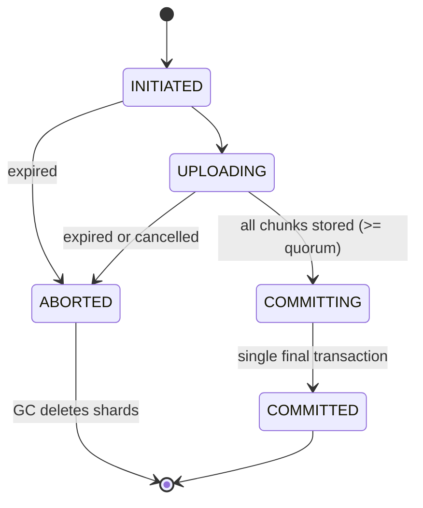
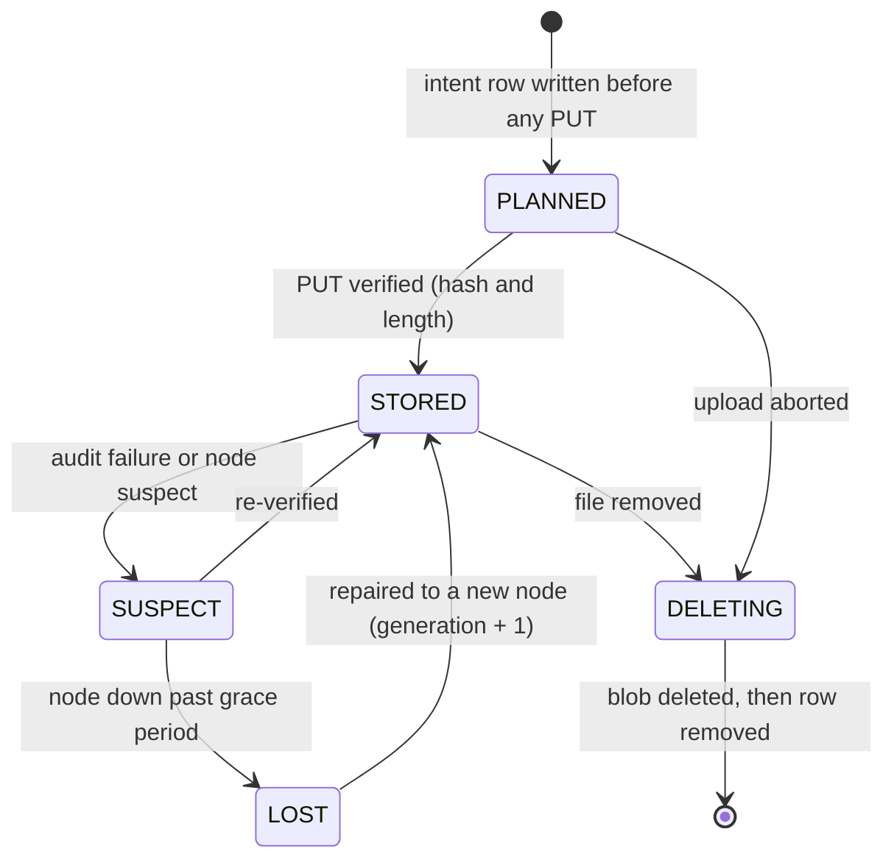
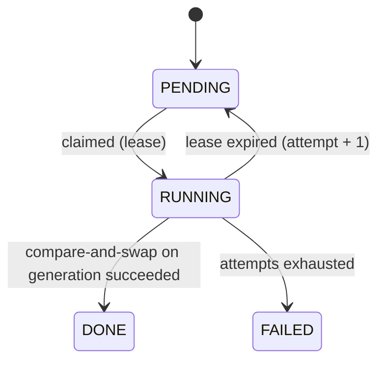
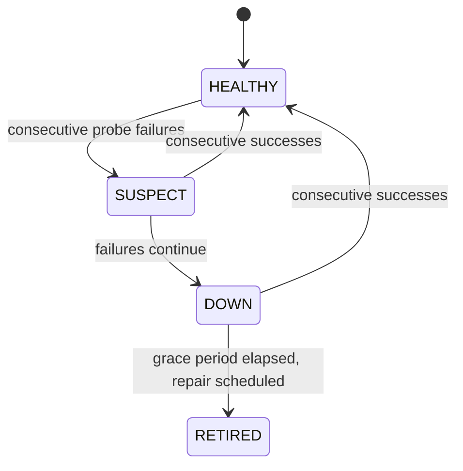

# Storage state machines (draft, proposed in ADRs 0005-0010)

## Upload session

```mermaid
stateDiagram-v2
    [*] --> INITIATED
    INITIATED --> UPLOADING
    UPLOADING --> COMMITTING: all chunks stored (>= quorum)
    COMMITTING --> COMMITTED: single final transaction
    INITIATED --> ABORTED: expired
    UPLOADING --> ABORTED: expired or cancelled
    ABORTED --> [*]: GC deletes shards
    COMMITTED --> [*]
```

## Shard placement

```mermaid
stateDiagram-v2
    [*] --> PLANNED: intent row written before any PUT
    PLANNED --> STORED: PUT verified (hash and length)
    STORED --> SUSPECT: audit failure or node suspect
    SUSPECT --> STORED: re-verified
    SUSPECT --> LOST: node down past grace period
    LOST --> STORED: repaired to a new node (generation + 1)
    STORED --> DELETING: file removed
    PLANNED --> DELETING: upload aborted
    DELETING --> [*]: blob deleted, then row removed
```

## Repair job

```mermaid
stateDiagram-v2
    [*] --> PENDING
    PENDING --> RUNNING: claimed (lease)
    RUNNING --> PENDING: lease expired (attempt + 1)
    RUNNING --> DONE: compare-and-swap on generation succeeded
    RUNNING --> FAILED: attempts exhausted
```

## Node health

```mermaid
stateDiagram-v2
    [*] --> HEALTHY
    HEALTHY --> SUSPECT: consecutive probe failures
    SUSPECT --> HEALTHY: consecutive successes
    SUSPECT --> DOWN: failures continue
    DOWN --> HEALTHY: consecutive successes
    DOWN --> RETIRED: grace period elapsed, repair scheduled
```
